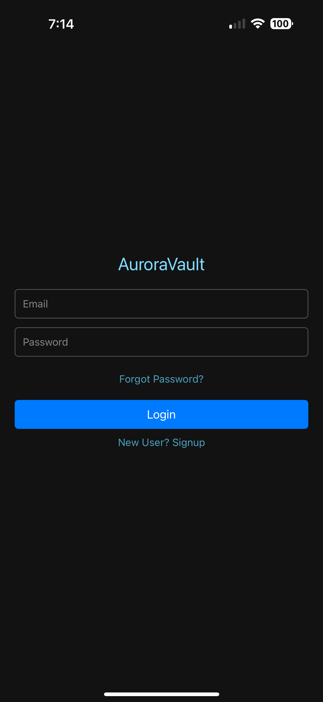
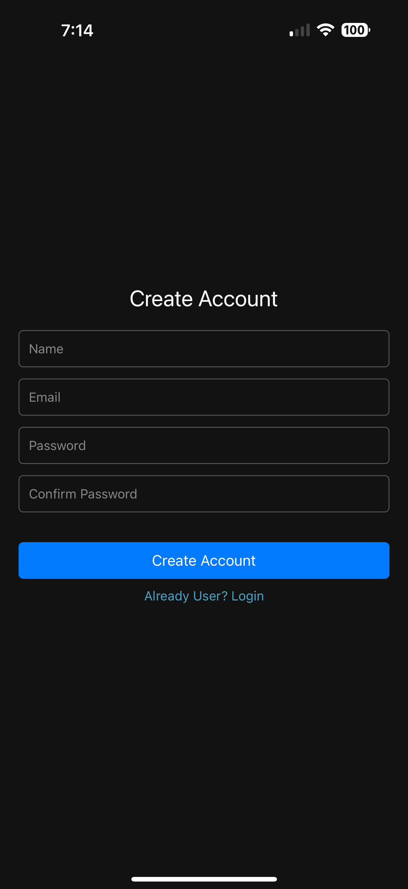

# AuroraVault: A Secure and Efficient Photo Storage Platform
[www.auroravault.com](https://www.auroravault.com)

Welcome to **AuroraVault**, a platform designed to help users securely store and manage their memories in the form of photos. This README outlines the services and architecture used in the application, highlighting scalability, reliability, and performance optimization.

---

## Overview
AuroraVault is a cloud-based photo storage platform designed to:
- Store and organize user photos securely.
- Provide scalable solutions for metadata storage, image uploads, and retrieval.
- Offer a seamless and efficient experience for individual users and families.

---

## Features
- **Photo Storage**: Upload, store, and retrieve photos in S3 buckets.
- **Batch Upload**: Efficiently upload up to 50 images at a time.
- **Metadata Storage**: Metadata stored in DynamoDB for fast retrieval.
- **Secure Uploads**: Use of presigned URLs for uploading images directly to S3.
- **Retry Mechanism**: Robust retry mechanism for image fetching with exponential backoff.
- **Pending Fetch Queue**: Maintain a list of images pending upload or fetch.
- **Notifications**: SES-powered welcome emails upon successful user registration.

---

## Architecture (Available soon)

---
## Prototype Screens

1. ### Login
   

2. ### Sign Up
   

3. ### Reset Password
   

4. ### Home Page
   

5. ### Uploading
   

---

## Services Used
### AWS Services
- **Amazon S3**: Photo storage with presigned URLs for secure and efficient uploads.
- **AWS DynamoDB**: Metadata storage with optimized partitioning for scalability and fast retrieval.
- **AWS Lambda**: Serverless compute for processing metadata, image uploads, and sending notifications.
- **Amazon CloudFront**: Content Delivery Network (CDN) to deliver images efficiently to mobile clients globally.
- **Amazon SQS**: Queue for scalable metadata processing to handle high concurrency.
- **AWS SES**: Email notifications for user communication, including welcome emails.
- **Amazon EventBridge**: Event-driven architecture to route events across microservices.
- **Amazon API Gateway**: REST API for secure user requests, presigned URL generation, and image retrieval.
- **Amazon Cognito**: User authentication and authorization for secure platform access.
- **AWS IAM**: Fine-grained access control for AWS resource security.
- **Amazon CloudWatch**: Monitoring and logging for error tracking and system performance.
- **Amazon SageMaker**: Potential for AI-powered features like intelligent photo tagging and album creation.
- **AWS Glue**: Data integration for preprocessing metadata and user analytics.

---
## Frontend Tools
1. **React Native with Expo**
   - Cross-platform mobile application development.
   - Enables seamless photo management on iOS and Android.

2. **AsyncStorage**
   - Caches user photos locally for quick access.
   - Maintains a pending fetch list for retries.

3. **Axios**
   - Handles API communication for image upload and retrieval.

---

## Load Test

Load testing was done on 10k+ Concurrent users and the system scaled beatufically with 0% failure rate. The RPS was at 2300. I will be pushing this to 100k and later millions.

---

## Future Enhancements
- **End-to-End Encryption**: Encrypting photos before upload for added security.
- **Family Sharing**: Allow family members to collaboratively manage shared albums.
- **AI Tagging**: Automatically tag photos with events, locations, and people.
- **Global Reach**: Multi-region S3 buckets and DynamoDB Global Tables for reduced latency.

---

##Contact

For inquiries, reach out at shuklavishwam111@gmail.com
